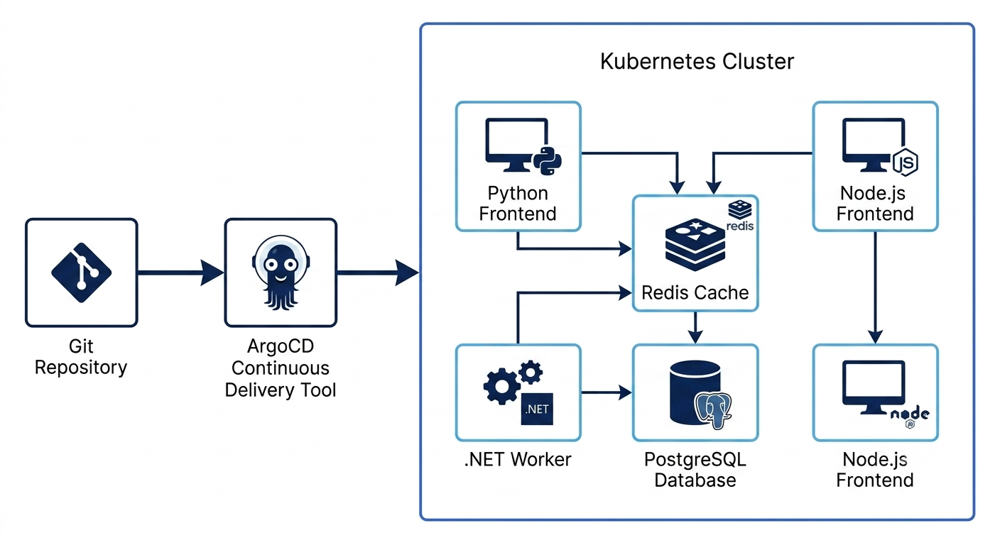
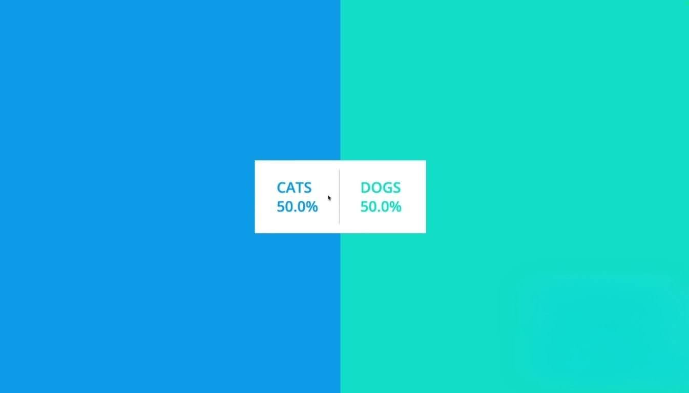

# 🐾 GitOps-Driven 3-Tier Voting App (Cats vs Dogs)

Welcome to my DevOps portfolio project! This project demonstrates a complete end-to-end GitOps workflow for a multi-tier microservices application (the classic "Cats vs. Dogs" voting app). 

The infrastructure was provisioned using **Terraform**, and the application lifecycle is managed automatically using **ArgoCD** on a **Kubernetes (K8s)** cluster.

## 🏗️ Architecture Diagram

*GitOps Workflow: Code changes in GitHub are automatically detected by ArgoCD, which then syncs and deploys the microservices (Python, Node.js, .NET, Redis, Postgres) into the Kubernetes cluster.*

## 📸 Application & Deployment Screenshots

### The Voting App (Cats vs Dogs)

*Users can vote for their favorite pet, and the results are processed in real-time.*

### ArgoCD UI (Live Sync)

*ArgoCD automatically syncing the K8s manifests from GitHub to the cluster.*

---

## 🛠️ Tech Stack & Microservices
* **Infrastructure as Code:** Terraform
* **Container Orchestration:** Kubernetes (K8s)
* **GitOps Tooling:** ArgoCD
* **The Microservices:** 
  * `vote` (Python) - Frontend for users to cast votes.
  * `redis` (Redis) - In-memory queue to hold votes.
  * `worker` (.NET) - Background processor fetching votes from Redis.
  * `db` (PostgreSQL) - Database storing the final vote counts.
  * `result` (Node.js) - Frontend displaying real-time results.

---

## 🚧 The Journey & Challenges Overcome
Deploying this in a cloud lab environment wasn't a straight line. Here is how I solved the real-world roadblocks:

1. **Environment Migration (Codespaces to KodeKloud):** Initially started on GitHub Codespaces but faced persistent port-forwarding and network restrictions. Migrated the entire workflow to a KodeKloud Lab for full control over K8s NodePorts.
2. **ArgoCD CRD Annotation Limits:** Encountered the infamous `metadata.annotations: Too long` error when applying ArgoCD manifests. Bypassed this bloat by utilizing the `--server-side` flag with `kubectl apply`.
3. **The Infinite Proxy Loop (`ERR_TOO_MANY_REDIRECTS`):** When accessing ArgoCD UI via NodePort, the lab's internal proxy conflicted with ArgoCD's strict HTTPS enforcement. I patched the ArgoCD server deployment with an `--insecure` flag to force HTTP routing, instantly restoring UI access.

---

## 🚀 How to Run (Quick Start)

### 1. Install ArgoCD (Server-Side Apply)
kubectl create namespace argocd
kubectl apply --server-side -n argocd -f [https://raw.githubusercontent.com/argoproj/argo-cd/stable/manifests/install.yaml](https://raw.githubusercontent.com/argoproj/argo-cd/stable/manifests/install.yaml)
